```{r, echo=FALSE, warning=FALSE, message=FALSE}
library(knitr)
opts_chunk$set(comment=NA, warning=FALSE, message=FALSE)
```

## Agenda

- Who Am I?
- What is R?
- What is Neo4j?
- RNeo4j

# Who Am I?

## Who Am I?

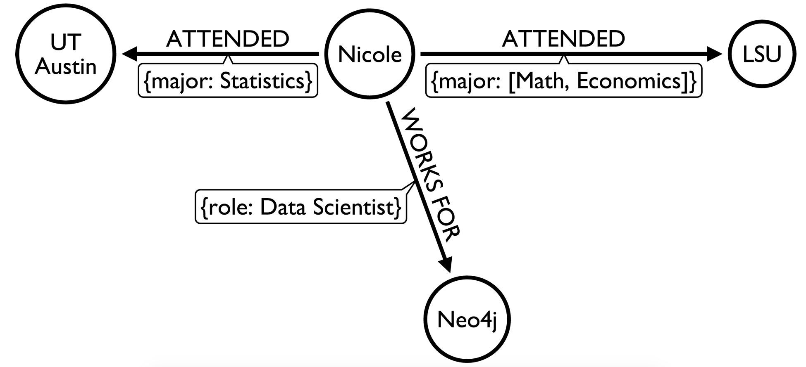

# What is R?

## What is R?

- A fully featured, statistical programming language
- Built by statisticians, for statisticians


# What is Neo4j?

## What is Neo4j?

- Neo4j is a graph database

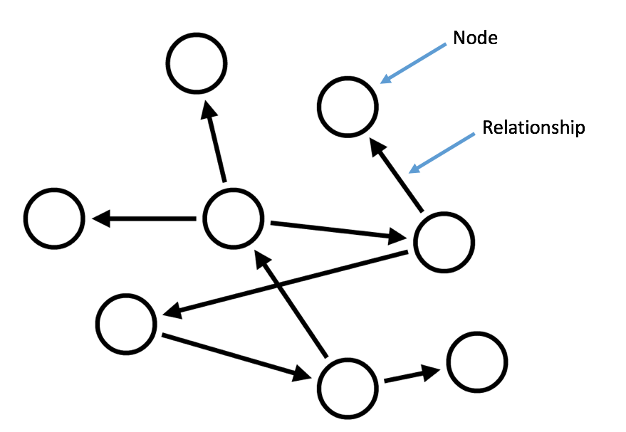

## What is a Graph Database?

- A graph database stores your data in a graph
- Tables and foreign keys are now nodes and relationships
- No joins, only traversals

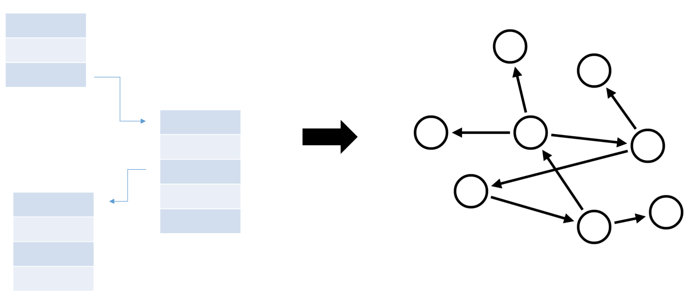

## From SQL to Neo4j

## Example: YouTube

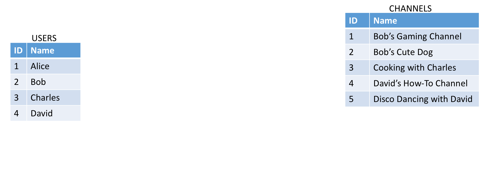

## Example: YouTube

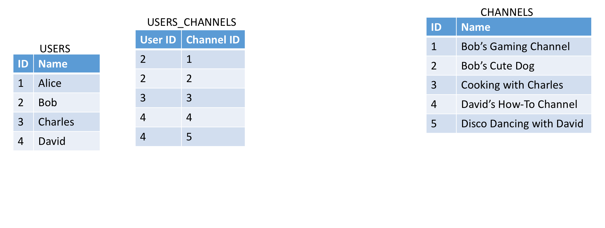

## Example: YouTube

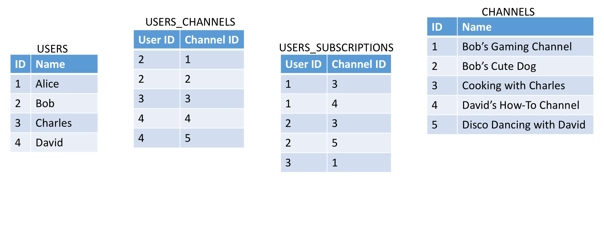

## Example: YouTube

Who subscribes to channels operated by David?

### SQL

```
SELECT sub.Name
FROM Users
JOIN Users_Channels
ON Users.ID = Users_Channels.UserID AND
   Users.Name = "David"
JOIN Users_Subscriptions
ON Users_Channels.ChannelID = Users_Subscriptions.ChannelID
JOIN Users sub
ON Users.ID = Users_Subscriptions.UserID;
```

## Example: YouTube

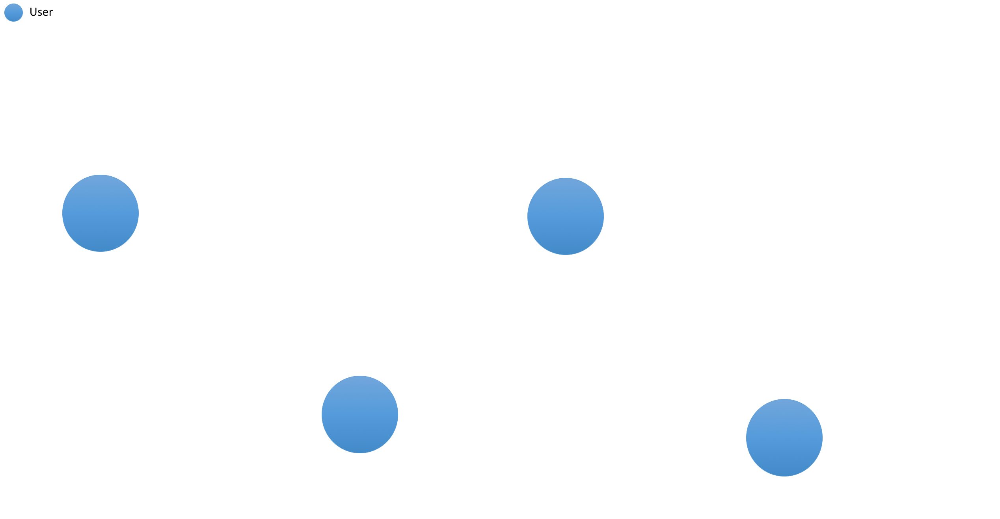

## Example: YouTube

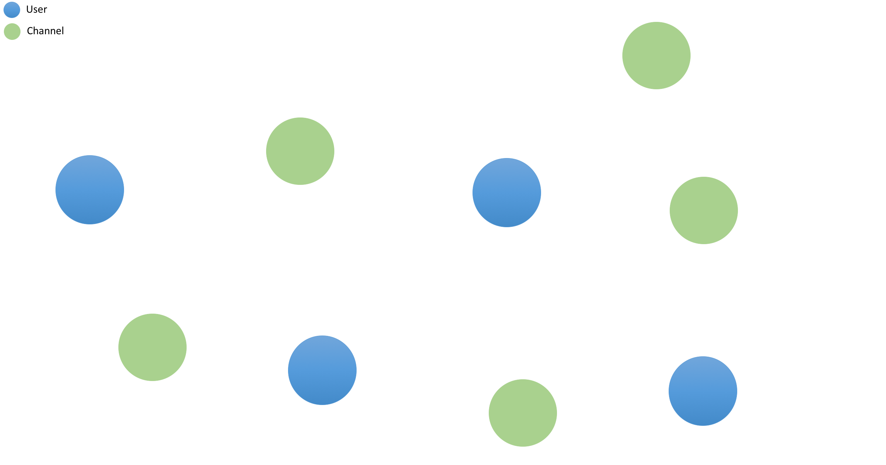

## Example: YouTube


## Example: YouTube

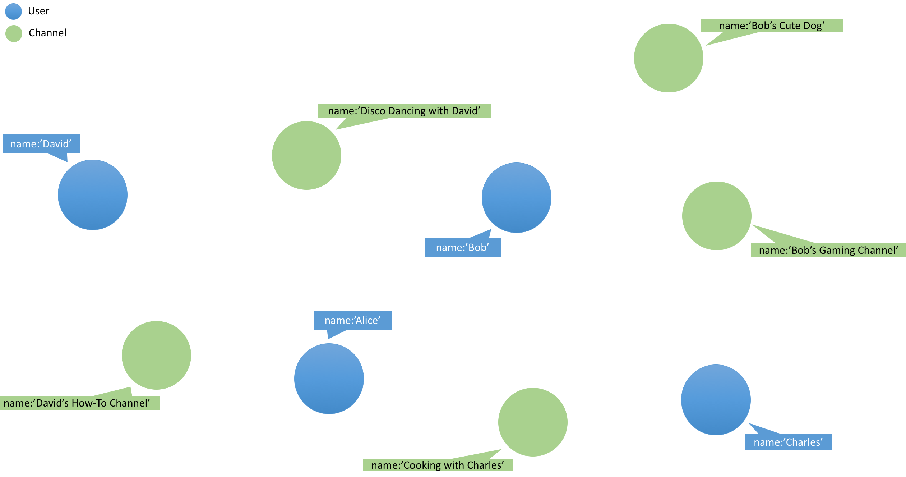

## Example: YouTube

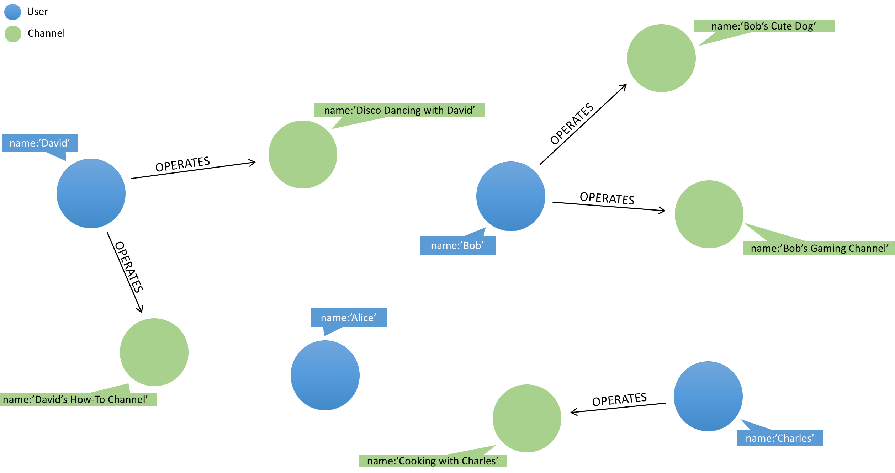

## Example: YouTube

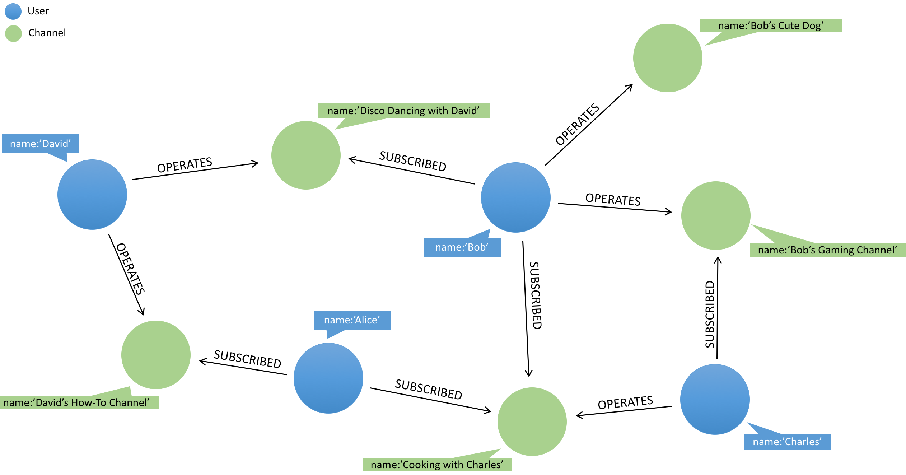

## Example: YouTube

Who subscribes to channels operated by David?

### Cypher

```
MATCH (u:User)-[:SUBSCRIBED]->(:Channel)<-[:OPERATES]-(d:User)
WHERE d.name = "David"
RETURN u.name;
```

# RNeo4j

## Example: Twitter

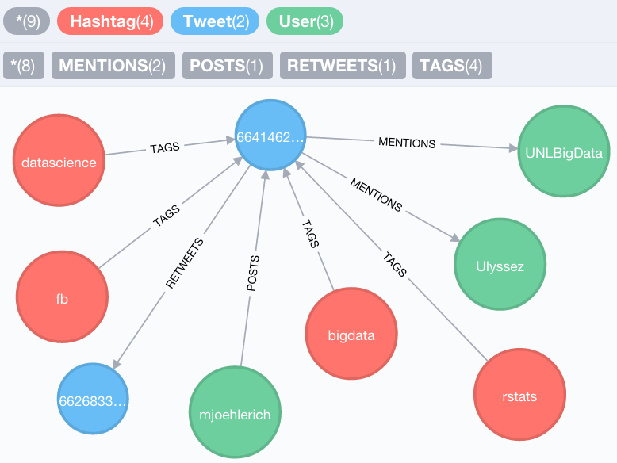

## Agenda

- Install
- Connect to Neo4j
- Cypher
- Visualization
- Graph Algorithms
- Graph Visualization
- Association Rules

## Install

```{r, eval=FALSE}
install.packages("RNeo4j")
```

```{r}
library(RNeo4j)
```

## Connect to Neo4j

```{r}
graph = startGraph("http://localhost:7474/db/data/")

graph
```

## Cypher

```{r}
query = "
MATCH (t:Tweet)-[:MENTIONS]->(u:User)
RETURN u.username AS username, COUNT(t) AS mentions
ORDER BY mentions DESC
LIMIT 5
"

data = cypher(graph, query)
data
```

## Visualization

```{r}
library(ggplot2)
```

## Visualization

```{r}
ggplot(data, aes(reorder(username, -mentions), mentions)) + 
  geom_bar(stat="identity")
```

## Visualization

```{r}
query = "
MATCH (h:Hashtag)-[:TAGS]->(t:Tweet)
WITH h, COUNT(t) AS tweets
ORDER BY tweets DESC LIMIT 10

WITH COLLECT(h) AS hash
UNWIND hash AS h1
UNWIND hash AS h2

MATCH (h1)-[:TAGS]->(:Tweet)<-[:TAGS]-(h2)
RETURN h1.name, h2.name, COUNT(*) AS weight
ORDER BY weight DESC
"
```

## Visualization

```{r}
hashtags = cypher(graph, query)
head(hashtags)
```

## Visualization

```{r}
ggplot(hashtags, aes(h1.name, h2.name)) +
  geom_tile(aes(fill = weight)) + 
  scale_fill_gradient(low = "white", high = "red") + 
  theme(axis.text.x = element_text(angle = 45, hjust = 1))
```

## Graph Algorithms

```{r}
library(igraph)
```

## Graph Algorithms

```{r}
query = "
MATCH (u1:User)-[:POSTS]->(:Tweet)-[:RETWEETS]->(t:Tweet),
      (u2:User)-[:POSTS]->(t)
RETURN u1.username AS from, u2.username AS to, COUNT(*) AS weight
"

edges = cypher(graph, query)
edges[1:5, ]
```

## Graph Algorithms

```{r}
ig = graph_from_data_frame(edges)
class(ig)
```

## Graph Algorithms

Who has the highest betweenness centrality in this subgraph?

$$betweenness(v) = \sum_{x \neq y \in V} \frac{\sigma_{xy}(v)}{\sigma_{xy}}$$

```{r}
b = betweenness(ig)
b = sort(b, decreasing = TRUE)

b[1:5]
```

## Graph Algorithms

Who has the highest closeness centrality in this subgraph?

$$closeness(v) =  \frac{1}{\sum_{y} d(v, y)}$$

```{r}
c = closeness(ig)
c = sort(c, decreasing = TRUE)

c[1:5]
```

## Graph Visualization

```{r}
V(ig)$size = 4
V(ig)$color = "cyan"
V(ig)$label = NA

plot(ig, edge.arrow.size = 0.1)
```

## Graph Visualization

```{r}
clusters = cluster_edge_betweenness(ig)

V(ig)$color = clusters$membership

plot(ig, edge.arrow.size = 0.1)
```

## Graph Visualization

```{r}
library(visNetwork)

id = unique(c(edges$from, edges$to))
nodes = data.frame(id = id, label = id)

nodes[1:5, ]
```

## Graph Visualization

```{r}
visNetwork(nodes, edges)
```

## Graph Visualization

```{r}
nodes$group = clusters$membership

visNetwork(nodes, edges)
```

## Association Rules

```{r, echo=FALSE}
options(scipen=20)
```

```{r}
library(arules)
library(tidyr)
```

## Association Rules

$$ \{onions, potatoes\} \Rightarrow \{burgers\}$$

## Association Rules

$$Lift(X \Rightarrow Y) = \frac{P(X \cap Y)}{P(X) \times P(Y)}$$

## Association Rules

$$Lift(rstats \Rightarrow analytics) = \frac{P(rstats \cap analytics)}{P(rstats) \times P(analytics)}$$

```{r}
query = "
MATCH (t:Tweet) WITH COUNT(*) AS total
MATCH (rstats:Hashtag {name:'rstats'}), 
      (ana:Hashtag {name:'analytics'})
WITH SIZE((rstats)-[:TAGS]->()) * 1.0 / total AS p_rstats,
     SIZE((ana)-[:TAGS]->()) * 1.0 / total AS p_ana,
     SIZE((rstats)-[:TAGS]->()<-[:TAGS]-(ana)) * 1.0 / total AS joint
RETURN joint / (p_rstats * p_ana) AS lift
"

cypher(graph, query)
```

## Association Rules

```{r}
query = "
MATCH (h:Hashtag)-[:TAGS]->(t:Tweet)
RETURN t.id, h.name AS hashtag
"

data = cypher(graph, query)
data[1:5, ]
```

## Association Rules

```{r}
data$present = TRUE
data = spread(data, hashtag, present, fill = FALSE)
data$t.id = NULL

data[1:5, 1:5]
```

## Association Rules

```{r}
data = as(data, "transactions")
data
```

## Association Rules

```{r}
rules = apriori(data, parameter=list(support=0.05))
```

## Association Rules

```{r, results="hide"}
d = inspect(sort(rules, by = "lift"))
```

```{r}
d[1, c(1:3, 6)]
```

# Conclusion

## Workflow


## Questions?

<center><h2>@_nicolemargaret</h2></center>
<br>
<center><h2>github.com/nicolewhite/RNeo4j</h2></center>
